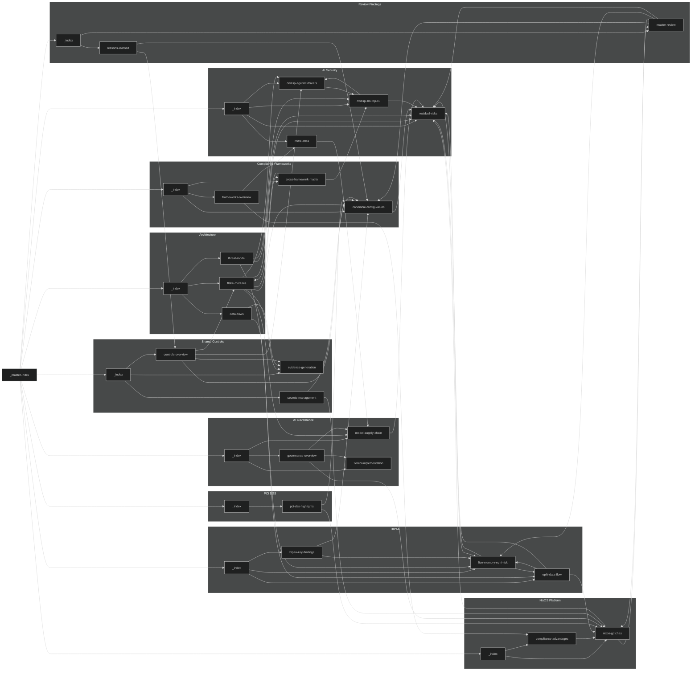

# Wiki Graph

Visual representation of the knowledge base link structure. Rendered by GitHub via Mermaid.

```mermaid
%%{init: {'theme': 'dark', 'themeVariables': {'fontSize': '12px'}}}%%
graph LR

  master-index["_master-index"]

  subgraph architecture["Architecture"]
    arch-idx["_index"]
    flake-modules["flake-modules"]
    data-flows["data-flows"]
    threat-model["threat-model"]
    arch-idx --> flake-modules
    arch-idx --> data-flows
    arch-idx --> threat-model
  end

  subgraph compliance-frameworks["Compliance Frameworks"]
    cf-idx["_index"]
    frameworks-overview["frameworks-overview"]
    cross-framework-matrix["cross-framework-matrix"]
    canonical-config-values["canonical-config-values"]
    cf-idx --> frameworks-overview
    cf-idx --> cross-framework-matrix
    cf-idx --> canonical-config-values
  end

  subgraph nixos-platform["NixOS Platform"]
    nix-idx["_index"]
    compliance-advantages["compliance-advantages"]
    nixos-gotchas["nixos-gotchas"]
    nix-idx --> compliance-advantages
    nix-idx --> nixos-gotchas
  end

  subgraph hipaa["HIPAA"]
    hipaa-idx["_index"]
    live-memory-ephi-risk["live-memory-ephi-risk"]
    ephi-data-flow["ephi-data-flow"]
    hipaa-key-findings["hipaa-key-findings"]
    hipaa-idx --> live-memory-ephi-risk
    hipaa-idx --> ephi-data-flow
    hipaa-idx --> hipaa-key-findings
  end

  subgraph pci-dss["PCI DSS"]
    pci-idx["_index"]
    pci-dss-highlights["pci-dss-highlights"]
    pci-idx --> pci-dss-highlights
  end

  subgraph ai-security["AI Security"]
    aisec-idx["_index"]
    owasp-llm-top-10["owasp-llm-top-10"]
    owasp-agentic-threats["owasp-agentic-threats"]
    mitre-atlas["mitre-atlas"]
    ai-security-residual-risks["residual-risks"]
    aisec-idx --> owasp-llm-top-10
    aisec-idx --> owasp-agentic-threats
    aisec-idx --> mitre-atlas
    aisec-idx --> ai-security-residual-risks
  end

  subgraph ai-governance["AI Governance"]
    aigov-idx["_index"]
    ai-governance-overview["governance-overview"]
    model-supply-chain["model-supply-chain"]
    tiered-implementation["tiered-implementation"]
    aigov-idx --> ai-governance-overview
    aigov-idx --> model-supply-chain
    aigov-idx --> tiered-implementation
  end

  subgraph shared-controls["Shared Controls"]
    sc-idx["_index"]
    shared-controls-overview["controls-overview"]
    evidence-generation["evidence-generation"]
    secrets-management["secrets-management"]
    sc-idx --> shared-controls-overview
    sc-idx --> evidence-generation
    sc-idx --> secrets-management
  end

  subgraph review-findings["Review Findings"]
    rf-idx["_index"]
    master-review["master-review"]
    lessons-learned["lessons-learned"]
    rf-idx --> master-review
    rf-idx --> lessons-learned
  end

  %% Master index → topic indexes
  master-index --> arch-idx
  master-index --> cf-idx
  master-index --> nix-idx
  master-index --> hipaa-idx
  master-index --> pci-idx
  master-index --> aisec-idx
  master-index --> aigov-idx
  master-index --> sc-idx
  master-index --> rf-idx

  %% Cross-topic links: architecture
  flake-modules --> canonical-config-values
  flake-modules --> ai-security-residual-risks
  flake-modules --> evidence-generation
  flake-modules --> owasp-agentic-threats
  flake-modules --> model-supply-chain
  flake-modules --> cross-framework-matrix
  data-flows --> ephi-data-flow
  data-flows --> evidence-generation
  threat-model --> ai-security-residual-risks
  threat-model --> live-memory-ephi-risk
  threat-model --> owasp-llm-top-10

  %% Cross-topic links: compliance frameworks
  frameworks-overview --> compliance-advantages
  frameworks-overview --> mitre-atlas
  cross-framework-matrix --> flake-modules
  cross-framework-matrix --> owasp-llm-top-10
  canonical-config-values --> ai-security-residual-risks

  %% Cross-topic links: nixos platform
  compliance-advantages --> nixos-gotchas
  nixos-gotchas --> master-review
  nixos-gotchas --> ai-security-residual-risks

  %% Cross-topic links: hipaa
  live-memory-ephi-risk --> ephi-data-flow
  live-memory-ephi-risk --> ai-security-residual-risks
  ephi-data-flow --> live-memory-ephi-risk
  ephi-data-flow --> ai-security-residual-risks
  ephi-data-flow --> nixos-gotchas
  hipaa-key-findings --> canonical-config-values
  hipaa-key-findings --> live-memory-ephi-risk

  %% Cross-topic links: pci-dss
  pci-dss-highlights --> nixos-gotchas
  pci-dss-highlights --> canonical-config-values

  %% Cross-topic links: ai-security
  owasp-llm-top-10 --> ai-security-residual-risks
  owasp-llm-top-10 --> owasp-agentic-threats
  owasp-agentic-threats --> owasp-llm-top-10
  mitre-atlas --> model-supply-chain
  ai-security-residual-risks --> live-memory-ephi-risk

  %% Cross-topic links: ai-governance
  ai-governance-overview --> nixos-gotchas
  ai-governance-overview --> tiered-implementation
  ai-governance-overview --> model-supply-chain
  model-supply-chain --> ai-security-residual-risks

  %% Cross-topic links: shared-controls
  shared-controls-overview --> flake-modules
  shared-controls-overview --> owasp-agentic-threats
  shared-controls-overview --> canonical-config-values
  shared-controls-overview --> evidence-generation
  secrets-management --> nixos-gotchas
  secrets-management --> canonical-config-values

  %% Cross-topic links: review findings
  master-review --> canonical-config-values
  master-review --> nixos-gotchas
  master-review --> live-memory-ephi-risk
  master-review --> ai-security-residual-risks
  lessons-learned --> shared-controls-overview
  lessons-learned --> canonical-config-values
```
