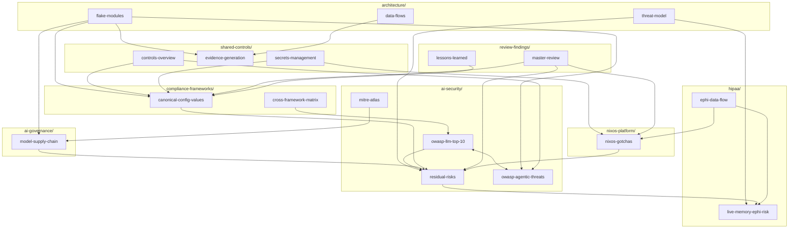

# Wiki Graph

Cross-topic connections in the knowledge base. For the full article list, see [[_master-index]].

This graph shows how the four most-referenced articles connect across topic boundaries. These are the nodes where knowledge converges — start here when looking for something.

**Hub articles** are referenced from 5+ topics — they reflect the project's key tensions:

| Hub | Tension |
|---|---|
| canonical-config-values | Where do the resolved settings live? |
| residual-risks | What can infrastructure not solve? |
| nixos-gotchas | Where does NixOS differ from expectations? |
| live-memory-ephi-risk | What is the single biggest security gap? |
