# Wiki Graph

Cross-topic connections in the knowledge base. For the full article list, see [[_master-index]].

This graph shows how the project's most-referenced articles connect across topic boundaries. These are the nodes where knowledge converges — start here when looking for something.

```mermaid
flowchart TD
  subgraph architecture["architecture/"]
    flake-modules
    data-flows
    threat-model
    meta-module
    boot-integrity
    ci-gate
    build-and-test-strategy
  end

  subgraph compliance-frameworks["compliance-frameworks/"]
    canonical-config-values
    cross-framework-matrix
    frameworks-overview
    hitrust-corrections
  end

  subgraph nixos-platform["nixos-platform/"]
    nixos-gotchas
    auditd-module-pattern
    github-actions-nix-stack
  end

  subgraph hipaa["hipaa/"]
    live-memory-ephi-risk
    ephi-data-flow
  end

  subgraph ai-security["ai-security/"]
    ai-security-residual-risks
    owasp-llm-top-10
    owasp-agentic-threats
    mitre-atlas
  end

  subgraph ai-governance["ai-governance/"]
    model-supply-chain
  end

  subgraph shared-controls["shared-controls/"]
    canonical-config
    evidence-generation
    secrets-management
    residual-risks-register
    account-lifecycle
    shared-controls-overview
  end

  subgraph review-findings["review-findings/"]
    master-review
    lessons-learned
  end

  %% canonical-config-values (compliance-frameworks) — audit-consumable resolved values
  flake-modules --> canonical-config-values
  secrets-management --> canonical-config-values
  master-review --> canonical-config-values
  lessons-learned --> canonical-config-values
  cross-framework-matrix --> canonical-config-values
  hitrust-corrections --> canonical-config-values

  %% canonical-config (shared-controls) — the typed-options contract behind the values
  flake-modules --> canonical-config
  account-lifecycle --> canonical-config
  evidence-generation --> canonical-config
  boot-integrity --> canonical-config
  canonical-config <--> canonical-config-values

  %% evidence-generation — shared runtime framework (ARCH-10)
  flake-modules --> evidence-generation
  data-flows --> evidence-generation
  account-lifecycle --> evidence-generation
  boot-integrity --> evidence-generation
  auditd-module-pattern --> evidence-generation

  %% residual-risks-register (shared-controls) — what infrastructure cannot solve
  threat-model --> residual-risks-register
  ai-security-residual-risks --> residual-risks-register
  meta-module --> residual-risks-register

  %% ai-security-residual-risks — the original AI-side gap inventory
  threat-model --> ai-security-residual-risks
  owasp-llm-top-10 --> ai-security-residual-risks
  model-supply-chain --> ai-security-residual-risks
  canonical-config-values --> ai-security-residual-risks
  master-review --> ai-security-residual-risks
  ai-security-residual-risks --> residual-risks-register

  %% nixos-gotchas — platform pitfalls that cut across topics
  secrets-management --> nixos-gotchas
  ephi-data-flow --> nixos-gotchas
  master-review --> nixos-gotchas
  nixos-gotchas --> ai-security-residual-risks
  account-lifecycle --> nixos-gotchas

  %% live-memory-ephi-risk — the #1 system risk
  threat-model --> live-memory-ephi-risk
  ai-security-residual-risks --> live-memory-ephi-risk
  ephi-data-flow --> live-memory-ephi-risk
  residual-risks-register --> live-memory-ephi-risk

  %% AI security chain
  owasp-llm-top-10 <--> owasp-agentic-threats
  mitre-atlas --> model-supply-chain
  cross-framework-matrix --> owasp-llm-top-10
  flake-modules --> owasp-agentic-threats
  shared-controls-overview --> owasp-agentic-threats

  %% Architecture — cross-cutting runtime + build
  boot-integrity --> nixos-gotchas
  meta-module --> evidence-generation
  ci-gate --> github-actions-nix-stack
  ci-gate --> nixos-gotchas
  build-and-test-strategy --> ci-gate
  build-and-test-strategy --> evidence-generation
  build-and-test-strategy --> boot-integrity
  flake-modules --> model-supply-chain

  %% Review-findings as originator of many canonical pointers
  master-review --> residual-risks-register
  lessons-learned --> evidence-generation
  lessons-learned --> canonical-config
```

**Hub articles** — recomputed 2026-04-24 from inbound-link counts. A hub is any article referenced from ≥5 other articles across ≥3 topics; these are where knowledge converges for the project's key tensions.

| Hub | Tension |
|---|---|
| canonical-config-values (compliance-frameworks/) | Where do the resolved cross-framework values live? |
| canonical-config (shared-controls/) | What typed-option contract does every behaviour module consume? |
| evidence-generation (shared-controls/) | How do framework modules plug into the shared snapshot cadence? |
| residual-risks-register (shared-controls/) | What can infrastructure not solve? |
| ai-security-residual-risks (ai-security/) | Which AI-specific gaps motivate the register? |
| nixos-gotchas (nixos-platform/) | Where does NixOS differ from expectations? |
| live-memory-ephi-risk (hipaa/) | What is the single biggest security gap? |

**Added 2026-04-24:** `canonical-config`, `evidence-generation`, `residual-risks-register` as new hubs (each now has ≥5 inbound edges, matching the post-ARCH realities of ARCH-02/04, ARCH-10, and ARCH-13 respectively). `residual-risks` node renamed to `ai-security-residual-risks` to match the actual file. New article nodes for `meta-module`, `boot-integrity`, `ci-gate`, `auditd-module-pattern`, `account-lifecycle`, `build-and-test-strategy`, `frameworks-overview`, `hitrust-corrections`, `github-actions-nix-stack`, and `shared-controls-overview`.
